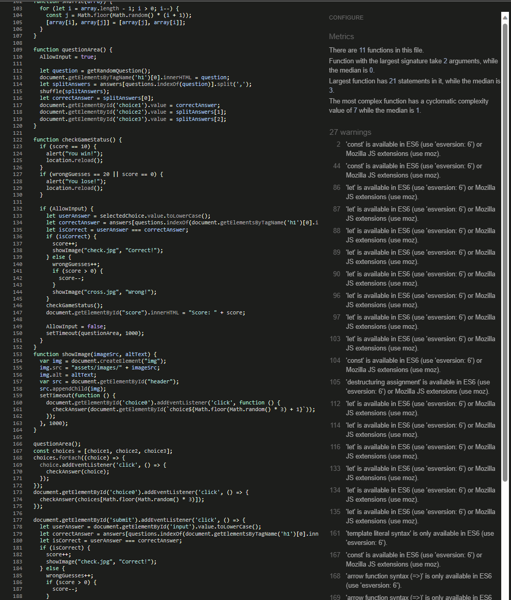

# Video Game Quiz

This is a site where you get to test your expansive video game knowledge. You're able to try and guess from a bunch of questions which I've set up beforehand. If you score 0 or get 20 wrong then you lose but if you get 10 right then you win, up for the challange?

Video Game Quiz is a game completely made in Javascript.

## Features

### Existing Features

- __The Question Area__

  - At the top of the page, the question area displays a random question from the game's database. The question is presented with 3 possible answers, each represented by a button. The question area is designed to be visually appealing and easy to read, with clear and concise wording that is easy to understand.

- __The Game Area__

  - This section will allow the user to enter what they believe the answer to be.
  - The user will be able to type and press enter to validate their question.
  - The question section is where the user will be able to see the question to answer as part of the game. The user will be able answer the questions in the answer box provide.
  - The user will be able to submit their answer and a pop-up will make it known to the user if they answered correctly.

- __Feedback Area__

After you submit your answer, the feedback area displays whether your answer was correct or incorrect. If you answered correctly, a green checkmark is displayed. If you answered incorrectly, a red X is displayed. The feedback area is designed to be informative and helpful, providing you with immediate feedback on your performance in the game.

- __The Score Area__

The score area displays your current score, as well as the total number of questions answered and the number of questions answered correctly. The score area is designed to be easy to read and understand, with clear and concise information that helps you keep track of your progress in the game.

- __Footer__
The footer displays the creator's name and a link to their website. The footer is designed to be unobtrusive and informative, providing you with additional information about the game's creator if you're interested in learning more.
---
- __Help Site__
An extra page that will help you understand the game better. It will tell you how to play the game and what the game is about. It will also tell you how to win and lose the game. 

## Testing

- I've tested that the game works.
- I've tested that the game has a win and lose condition.
- I've tested so that the code in the Javascript works as expected, even on GitHub Pages.

- I've checked that the site looks okay on different screen sizes.

- I've made sure it scored high in lighthouse.

## Bugs

- The score counter awkwardly slides underneath the score text on other screen sizes.

### Validator Testing

- HTML
  - No errors were returned when passing through the official [W3C validator.](https://validator.w3.org/nu/?doc=https://kate-karui.github.io/JavaScript-Project/) 
- CSS
  - No errors were found when passing through the official [(Jigsaw) validator.](https://jigsaw.w3.org/css-validator/validator?uri=https%3A%2F%2Fkate-karui.github.io%2FJavaScript-Project%2F&profile=css3svg&usermedium=all&warning=1&vextwarning=&lang=en) 
- JavaScript
  - No errors were found when passing through the official [Jshint validator.](https://jshint.com/)

 

- The following metrics were returned:
  - There are 6 functions in this file.

  - Function with the largest signature take 2 arguments, while the median is 0.

    - Largest function has 19 statements in it, while the median is 5.

    - The most complex function has a cyclomatic complexity value of 3 while the median is 2.

### Unfixed Bugs

- The score counter awkwardly slides underneath the score text on other screen sizes.
  - Difficutlies making both the paragraphs move as one.

## Deployment

- The site was deployed to GitHub pages. The steps to deploy are as follows:
  - In the GitHub repository, navigate to the Settings tab.
  - From the source section drop-down menu, select the Master Branch.
  - Once the master branch has been selected, the page will be automatically refreshed with a detailed ribbon display to indicate the successful deployment.

The live link can be found [here.](https://kate-karui.github.io/Video-Game-Quiz/)

## Wireframe

- ## Credits

- ### Content

  - Javascript guidance taken from Bing AI.

- ### Media

  - Checkmark taken from [clipartbest.com](http://www.clipartbest.com/clipart-dT85e6aqc)
  - Cross mark taken from [clker.com](https://clipartcraft.com/download.html)
  - Controller favicon taken from [gamingcypher](https://gamingcypher.com/xbox-one-the-new-generation-xbox-controller-detailed/)

## Conclusion

- Video Game Quiz is a fun and challenging game that tests your knowledge of video games. With its intuitive interface, informative feedback, and easy-to-understand instructions, it's the perfect game for anyone who loves video games and wants to test their knowledge. So why not give it a try today and see how well you do?